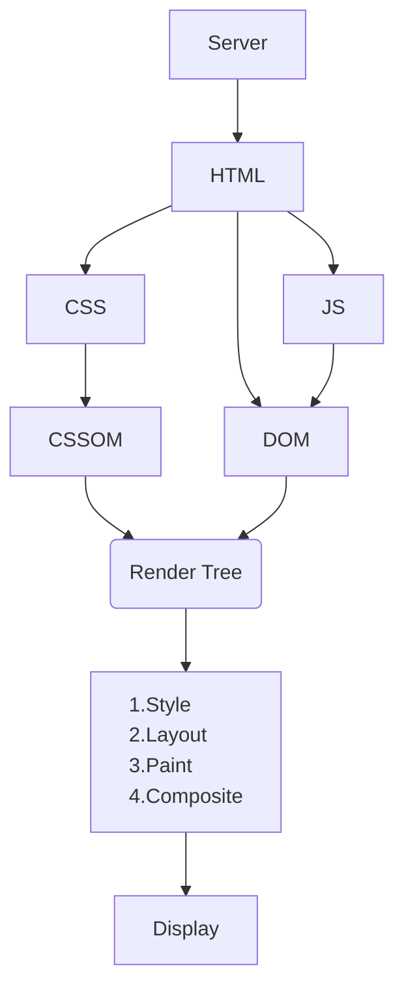

## Rendering Path Diagram
---

## Core Web Vitals
---
Metrics that measure **loading performance**, **interactivity**, and **visual stability**.

LCP (loading): Largest Contentful Paint
INP (interactively): Interaction to Next Paint
CLS (visual stability): Cumulative Layout Shift

**Diagnostic metrics**
FCP: First Contentful Paint
TBT: Total Blocking Time
