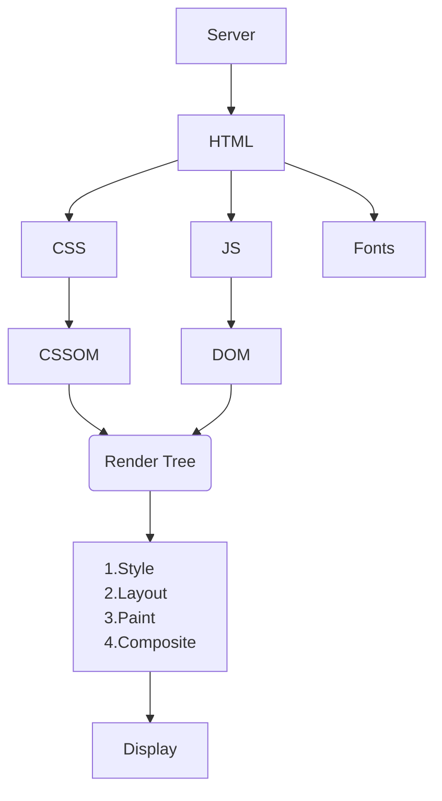

```mermaid
flowchart TD

RenderTree(Render Tree)

style RenderSteps text-align:left
RenderSteps["`
	1.Style
	2.Layout
	3.Paint
	4.Composite
`"]

Server --> HTML
HTML   --> CSS --> CSSOM
HTML   --> JS  --> DOM
HTML   --> Fonts

CSSOM  --> RenderTree
DOM    --> RenderTree

RenderTree  --> RenderSteps
RenderSteps --> Display

```
## Core Web Vital
